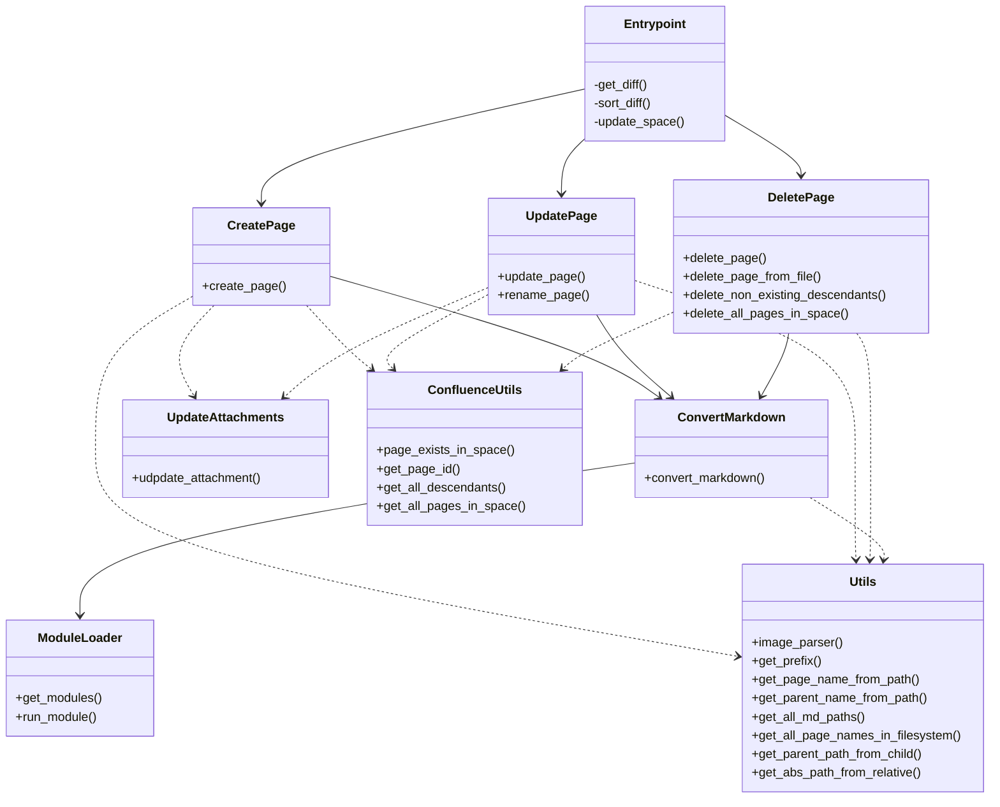

```mermaid
classDiagram

Entrypoint --> CreatePage
Entrypoint --> UpdatePage
Entrypoint --> DeletePage
CreatePage --> ConvertMarkdown
UpdatePage --> ConvertMarkdown
DeletePage --> ConvertMarkdown
ConvertMarkdown --> ModuleLoader
CreatePage ..> UpdateAttachments
UpdatePage ..> UpdateAttachments
CreatePage ..> Utils
UpdatePage ..> Utils
DeletePage ..> Utils
CreatePage ..> ConfluenceUtils
UpdatePage ..> ConfluenceUtils
DeletePage ..> ConfluenceUtils
ConvertMarkdown ..> Utils

class Entrypoint{
    -get_diff()
    -sort_diff()
    -update_space()
}

class UpdateAttachments{
    +udpdate_attachment()
}

class ConfluenceUtils{
    +page_exists_in_space()
    +get_page_id()
    +get_all_descendants()
    +get_all_pages_in_space()

}

class CreatePage{
    +create_page()
}

class UpdatePage{
    +update_page()
    +rename_page()
}

class DeletePage{
    +delete_page()
    +delete_page_from_file()
    +delete_non_existing_descendants()
    +delete_all_pages_in_space()
}

class ModuleLoader{
    +get_modules()
    +run_module()
}

class ConvertMarkdown{
    +convert_markdown()
}

class Utils{
    +image_parser()
    +get_prefix()
    +get_page_name_from_path()
    +get_parent_name_from_path()
    +get_all_md_paths()
    +get_all_page_names_in_filesystem()
    +get_parent_path_from_child()
    +get_abs_path_from_relative()
}

```
