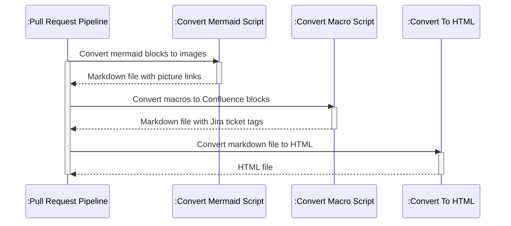
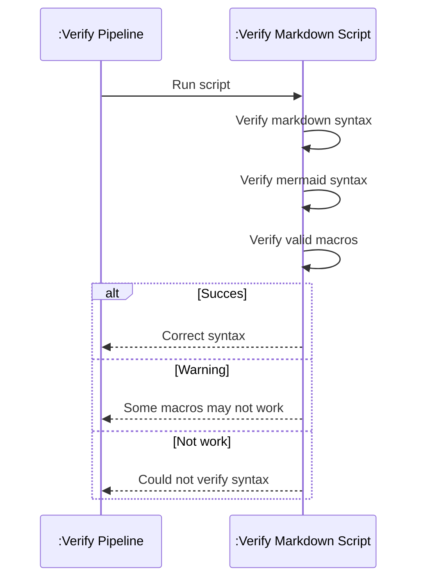

First pull request pipeline sequence diagram

```mermaid
sequenceDiagram
        participant pip as :Pull Request Pipeline
        participant mermaid as :Convert Mermaid Script
        participant macro as :Convert Macro Script
        participant html as :Convert To HTML

        pip ->> mermaid :Convert mermaid blocks to images
        activate pip
        activate mermaid
        mermaid -->> pip :Markdown file with picture links
        deactivate mermaid

        pip ->> macro :Convert macros to Confluence blocks
        activate macro
        macro -->> pip :Markdown file with Jira ticket tags
        deactivate macro

        pip ->> html :Convert markdown file to HTML
        activate html
        html -->> pip :HTML file
        deactivate html
        deactivate pip
```

Pipeline for verifying the markdown files

```mermaid
        sequenceDiagram
        participant pip as :Verify Pipeline
        participant md as :Verify Markdown Script

        pip ->> md: Run script
        md ->> md: Verify markdown syntax
        md ->> md: Verify mermaid syntax
        md ->> md: Verify valid macros

        alt Succes
          md -->> pip: Correct syntax
        else Warning
          md -->> pip: Some macros may not work
        else Not work
          md -->> pip: Could not verify syntax
        end
        
```