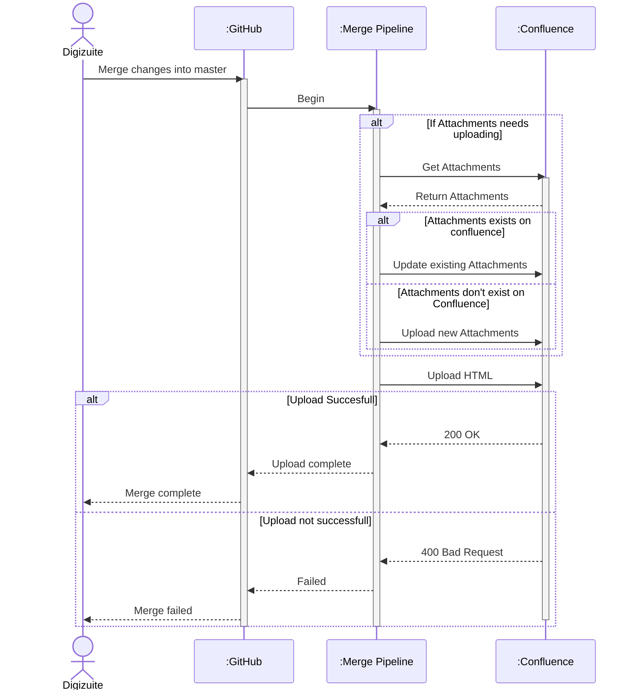
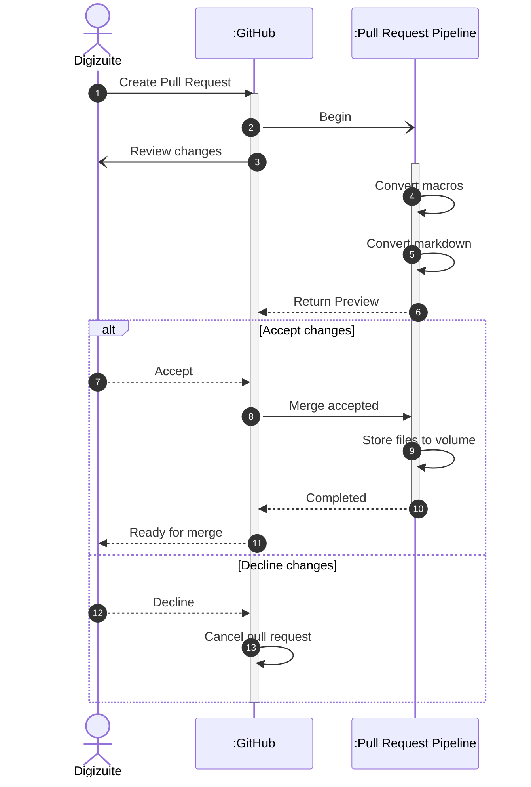
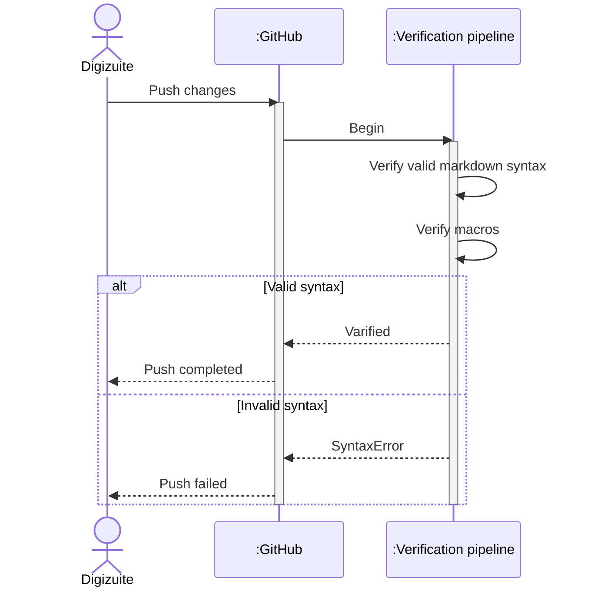

# First sequence diagram for the merge pipeline

```mermaid
        sequenceDiagram
        actor dig as Digizuite
        participant git as :GitHub
        participant pip as :Merge Pipeline
        participant conf as :Confluence

        dig ->> git: Merge changes into master
        activate git
        git ->> pip: Begin
        activate pip
        alt If Attachments needs uploading
          pip ->> conf: Get Attachments
          activate conf
          conf -->> pip: Return Attachments
          alt Attachments exists on confluence
            pip ->> conf: Update existing Attachments
          else Attachments don't exist on Confluence
            pip ->> conf: Upload new Attachments
          end
        end
        pip ->> conf: Upload HTML
        alt Upload Succesfull
          conf -->> pip: 200 OK
          pip -->> git: Upload complete
          git -->> dig: Merge complete
        else Upload not successfull
          conf -->> pip: 400 Bad Request
          pip -->> git: Failed
          git -->> dig: Merge failed
          deactivate conf
        end
        deactivate pip
        deactivate git
```

# First diagram for a pull request pipeline

```mermaid
        sequenceDiagram
        autonumber
        actor dig as Digizuite
        participant git as :GitHub
        participant pip as :Pull Request Pipeline

        dig ->> git: Create Pull Request
        activate git
        git -) pip: Begin
        git -) dig: Review changes
        activate pip
        pip ->> pip: Convert macros
        pip ->> pip: Convert markdown
        pip -->> git: Return Preview
        alt  Accept changes
          dig -->> git: Accept
          git ->> pip: Merge accepted
          pip ->> pip: Store files to volume
          pip -->> git: Completed
          deactivate pip
          git -->> dig: Ready for merge
        else Decline changes  
          dig -->> git: Decline
          git ->> git: Cancel pull request
        end
        deactivate git
```

# First diagram for a push pipeline

```mermaid
        sequenceDiagram
        actor dig as Digizuite
        participant git as :GitHub
        participant pip as :Verification pipeline

        dig ->> git: Push changes
        activate git
        git ->> pip: Begin
        activate pip
        pip ->> pip: Verify valid markdown syntax
        pip ->> pip: Verify macros
        alt Valid syntax
            pip -->> git: Varified
            git -->> dig: Push completed
        else Invalid syntax
            pip -->> git: SyntaxError
            git -->> dig: Push failed
        end
        deactivate pip
        deactivate git
    
```