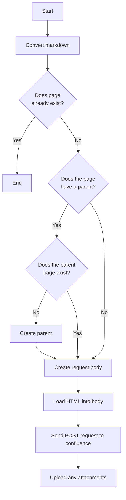

```mermaid
flowchart TD
A[Start] --> B[Convert markdown]
B --> C{Does page \n already exist?}
C --> |Yes| D[End]
C --> |No| E{Does the page \n have a parent?}
E --> |Yes| F{Does the parent\n page exist?}
F --> |No| G[Create parent]
F --> |Yes| H[Create request body]
E --> |No| H
G --> H
H --> I[Load HTML into body]
I --> J[Send POST request to confluence]
J --> K[Upload any attachments]

```