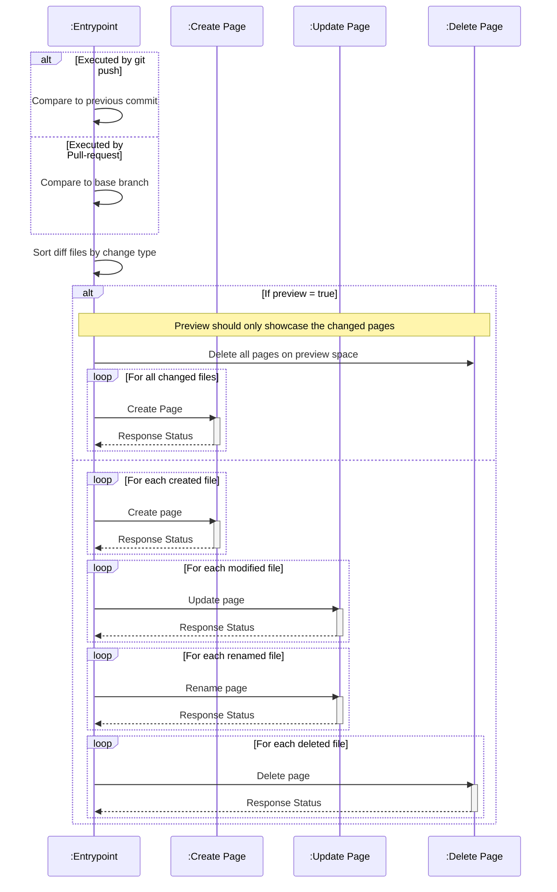

```mermaid
sequenceDiagram
participant ep as :Entrypoint
participant cp as :Create Page
participant up as :Update Page
participant dp as :Delete Page

alt Executed by git push
    ep ->> ep: Compare to previous commit
else Executed by Pull-request
    ep ->> ep: Compare to base branch
end
ep ->> ep: Sort diff files by change type
alt If preview = true
    Note over ep,dp: Preview should only showcase the changed pages
    ep ->> dp: Delete all pages on preview space
    loop For all changed files
        ep ->> cp: Create Page
        activate cp
        cp -->> ep: Response Status
        deactivate cp
    end
else
    loop For each created file
        ep ->> cp: Create page
        activate cp
        cp -->> ep: Response Status
        deactivate cp
    end
    loop For each modified file
        ep ->> up: Update page
        activate up
        up -->> ep: Response Status
        deactivate up
    end
    loop For each renamed file
        ep ->> up: Rename page
        activate up
        up -->> ep: Response Status
        deactivate up
    end
    loop For each deleted file
        ep ->> dp: Delete page
        activate dp
        dp -->> ep: Response Status
        deactivate dp
    end
end
```