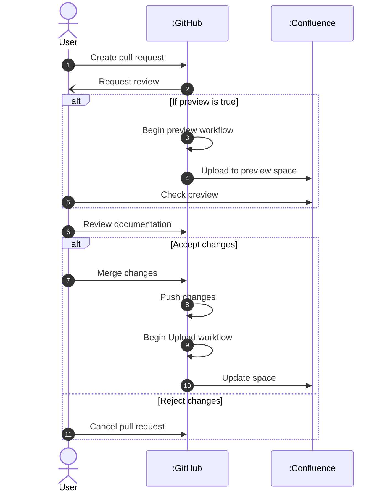

# Pull request workflow

```mermaid
sequenceDiagram
autonumber
actor user as User
participant gh as :GitHub
participant con as :Confluence

user->>gh: Create pull request
gh-)user: Request review
alt If preview is true
    gh->>gh: Begin preview workflow
    gh->>con: Upload to preview space
    user->>con: Check preview
end
user->>gh: Review documentation
alt Accept changes
    user->>gh: Merge changes
    gh->>gh: Push changes
    gh->>gh: Begin Upload workflow
    gh->>con: Update space
else Reject changes
    user->>gh: Cancel pull request
end

```