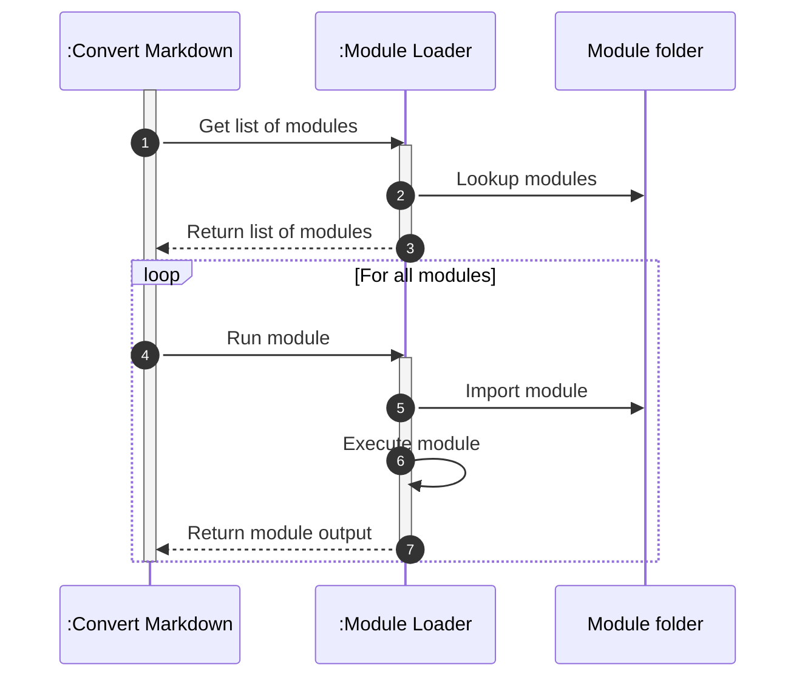
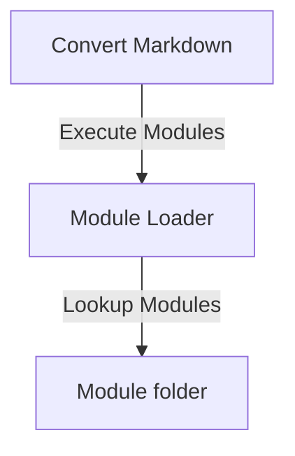

```mermaid
sequenceDiagram
autonumber
participant convert as :Convert Markdown
participant ml as :Module Loader
participant mf as Module folder

activate convert
convert->>ml: Get list of modules
activate ml
ml->>mf: Lookup modules
ml-->>convert: Return list of modules
deactivate ml
loop For all modules
    convert->>ml: Run module
    activate ml
    ml->>mf: Import module
    ml->>ml: Execute module
    ml-->>convert: Return module output
    deactivate ml
end
deactivate convert

```

```mermaid
graph TD

A[Module Loader]-->|Lookup Modules|B[Module folder]
C[Convert Markdown]-->|Execute Modules|A

```